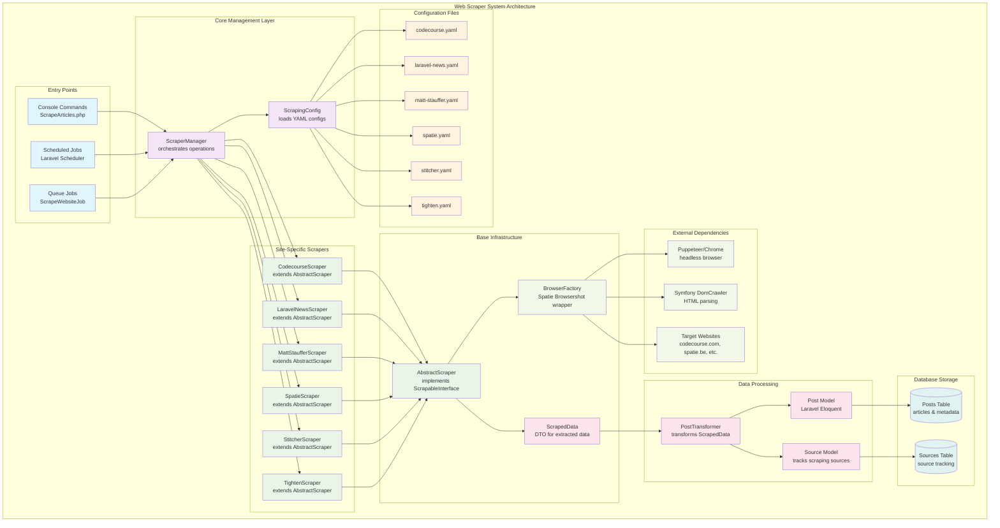
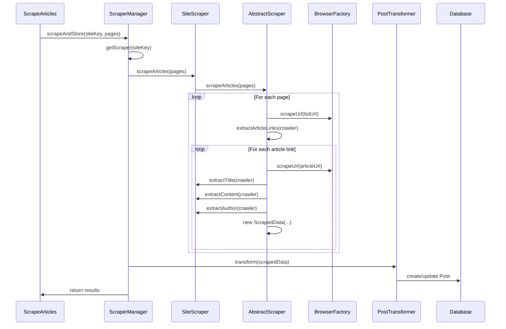

# 🚀 Reusable Web Scraper System

A powerful, scalable web scraping system built for Laravel using Spatie Browsershot and Symfony DomCrawler. Currently supports 5 major PHP/Laravel content sources with the ability to scale to 40-50 websites.

## 📋 Table of Contents

- [Overview](#overview)
- [Available Scrapers](#available-scrapers)
- [Architecture](#architecture)
- [Installation](#installation)
- [Configuration](#configuration)
- [Usage](#usage)
- [Running Individual Scrapers](#running-individual-scrapers)
- [Scheduled Scraping](#scheduled-scraping)
- [Adding New Sites](#adding-new-sites)
- [Commands](#commands)
- [Architecture Diagram](#architecture-diagram)
- [Troubleshooting](#troubleshooting)
- [Advanced Features](#advanced-features)

## 🎯 Overview

This scraper system provides:

- **Reusable Architecture** - Easily add new websites
- **Rate Limiting** - Respectful scraping with configurable delays
- **Error Handling** - Retry mechanisms and failure recovery
- **Data Transformation** - Clean data that maps to your Post model
- **Health Monitoring** - Check site availability
- **Queue Support** - Background processing (extensible)
- **Multi-Site Support** - 5 active scrapers with consistent architecture

## 🌐 Available Scrapers

Currently supports these high-quality PHP/Laravel content sources:

| Site | Scraper Key | Content Type | Status | Special Features |
|------|-------------|--------------|---------|------------------|
| **Codecourse** | `codecourse` | Tutorials, Articles | ✅ Active | Video content metadata |
| **Laravel News** | `laravel-news` | News, Tutorials | ⚠️ Cloudflare Protected | Premium Laravel content |
| **Matt Stauffer** | `matt-stauffer` | Articles, Insights | ✅ Active | Personal blog, ~213 articles |
| **Spatie** | `spatie` | Package docs, Tutorials | ✅ Active | Open source focus |
| **Stitcher.io** | `stitcher` | PHP articles, Insights | ✅ Active | Brent Roose's blog, ~264 articles |
| **Tighten** | `tighten` | Articles only | ✅ Active | Filters out podcasts automatically |

### Content Quality
- **High-quality** Laravel, PHP, and web development content
- **Active maintenance** with regular updates
- **Diverse perspectives** from individual developers and teams
- **Comprehensive coverage** of Laravel ecosystem

### Quick Reference

```bash
# List all available scrapers
php artisan scrape:articles invalid-site
# Output: Available scrapers: codecourse, laravel-news, matt-stauffer, spatie, stitcher, tighten

# Health check all active scrapers
php artisan scrape:articles codecourse --health      # Tutorials
php artisan scrape:articles matt-stauffer --health   # Personal blog
php artisan scrape:articles spatie --health          # Package docs  
php artisan scrape:articles stitcher --health        # PHP insights
php artisan scrape:articles tighten --health         # Team insights

# Production-ready scraping commands
php artisan scrape:articles codecourse --pages=1     # ~10 articles
php artisan scrape:articles spatie --pages=1         # ~10 articles
php artisan scrape:articles matt-stauffer --pages=1  # ~213 total
php artisan scrape:articles stitcher --pages=1       # ~264 total  
php artisan scrape:articles tighten --pages=1        # Articles only
```

## 🏗️ Architecture

```
app/Services/Scraping/
├── Contracts/
│   ├── ScrapableInterface.php       # Main scraper contract
│   ├── ConfigurableInterface.php    # Configuration management
│   └── TransformableInterface.php   # Data transformation
├── Core/
│   ├── ScraperManager.php          # Orchestrates scraping operations
│   ├── BrowserFactory.php          # Browsershot wrapper
│   └── ScrapedData.php             # Data transfer object
├── Scrapers/
│   ├── AbstractScraper.php         # Base scraper functionality
│   └── Sites/
│       ├── CodecourseScraper.php   # Codecourse implementation
│       ├── LaravelNewsScraper.php  # Laravel News implementation
│       ├── MattStaufferScraper.php # Matt Stauffer blog implementation
│       ├── SpatieScraper.php       # Spatie blog implementation
│       ├── StitcherScraper.php     # Stitcher.io implementation
│       └── TightenScraper.php      # Tighten insights implementation
├── Transformers/
│   └── PostTransformer.php         # Transforms scraped data to Post model
└── Configuration/
    ├── ScrapingConfig.php          # Configuration loader
    └── configs/
        ├── codecourse.yaml         # Codecourse configuration
        ├── laravel-news.yaml       # Laravel News configuration
        ├── matt-stauffer.yaml      # Matt Stauffer configuration
        ├── spatie.yaml             # Spatie configuration
        ├── stitcher.yaml           # Stitcher.io configuration
        └── tighten.yaml            # Tighten configuration
```

### Key Components

1. **ScrapableInterface** - Contract all scrapers must implement
2. **AbstractScraper** - Base class with common functionality
3. **ScraperManager** - Central orchestrator for all scraping operations
4. **PostTransformer** - Converts scraped data to Laravel Post models
5. **YAML Configs** - Site-specific configuration files

## 🔧 Installation

### Dependencies

The scraper system uses these packages:

```bash
composer require spatie/browsershot symfony/dom-crawler symfony/yaml
```

### System Requirements

- **Node.js & npm** - For Puppeteer (Browsershot dependency)
- **Chrome/Chromium** - Headless browser engine
- **PHP 8.2+** - For modern PHP features

### Setup

1. **Install Puppeteer** (if not already installed):
```bash
npm install puppeteer
```

2. **Run Migrations** (user_id made nullable for scraped sources):
```bash
php artisan migrate
```

3. **Verify Installation**:
```bash
# Test any of the available scrapers
php artisan scrape:articles codecourse --health
php artisan scrape:articles spatie --health
php artisan scrape:articles matt-stauffer --health
```

## ⚙️ Configuration

### Site Configuration (YAML)

Each website needs a YAML configuration file in `app/Services/Scraping/Configuration/configs/`:

```yaml
# codecourse.yaml
site_key: "codecourse"
name: "Codecourse"
base_url: "https://codecourse.com"
articles_url: "https://codecourse.com/articles"
rate_limit: 2000  # milliseconds between requests

selectors:
  article_links: "h2 a[href*='/articles/']"
  title: "h1"
  content: ".prose"
  excerpt: "meta[name='description']"
  author: ".border-t .font-semibold.bg-gradient-to-r"
  author_avatar: "img[src*='codecourse-avatars']"
  published_at: ".text-xs.uppercase.font-medium"
  reading_time: ".text-xs.uppercase.font-medium"
  tags: ".rounded-full"
  featured_image: "meta[property='og:image']"

browser:
  timeout: 30000
  user_agent: "Mozilla/5.0 (Windows NT 10.0; Win64; x64) AppleWebKit/537.36"
  wait_until_network_idle: true
  headers:
    Accept: "text/html,application/xhtml+xml,application/xml;q=0.9,*/*;q=0.8"
    Accept-Language: "en-US,en;q=0.5"

retry:
  max_attempts: 3
  delay_ms: 1000
```

### Required Fields

- `site_key` - Unique identifier
- `name` - Human-readable site name
- `base_url` - Website base URL
- `selectors.title` - CSS selector for article title
- `selectors.content` - CSS selector for article content

### Optional Fields

- `rate_limit` - Delay between requests (default: 2000ms)
- `browser.*` - Browsershot configuration
- `retry.*` - Retry behavior
- All other selectors for enhanced data extraction

## 🚀 Usage

### Basic Commands

```bash
# Health check - verify site is accessible
php artisan scrape:articles codecourse --health

# Scrape 1 page (typically 10 articles)
php artisan scrape:articles codecourse --pages=1

# Scrape multiple pages
php artisan scrape:articles codecourse --pages=3

# Update existing articles
php artisan scrape:articles codecourse --pages=1 --update
```

### Programmatic Usage

```php
use App\Services\Scraping\Core\ScraperManager;

$scraperManager = new ScraperManager();

// Health check
$health = $scraperManager->getSiteHealth('codecourse');
if ($health['status'] === 'healthy') {
    echo "Site is accessible!";
}

// Scrape and store articles
$results = $scraperManager->scrapeAndStore('codecourse', $pages = 2, $updateExisting = false);

echo "Created: {$results['articles_created']} articles";
echo "Updated: {$results['articles_updated']} articles";
echo "Errors: " . count($results['errors']);

// Scrape single article
$result = $scraperManager->scrapeArticle('codecourse', 'https://codecourse.com/articles/some-article');
```

### Data Flow

1. **ScraperManager** loads site configuration
2. **Site-specific scraper** extracts HTML using Browsershot
3. **DomCrawler** parses HTML and extracts data
4. **PostTransformer** converts to Post model format
5. **Database** stores as published Post records

## 🎯 Running Individual Scrapers

### Quick Start Commands

Each scraper can be run independently with the same command structure:

```bash
# Health checks (verify accessibility)
php artisan scrape:articles codecourse --health      # ✅ Active
php artisan scrape:articles laravel-news --health    # ⚠️ Cloudflare protected
php artisan scrape:articles matt-stauffer --health   # ✅ Active  
php artisan scrape:articles spatie --health          # ✅ Active
php artisan scrape:articles stitcher --health        # ✅ Active
php artisan scrape:articles tighten --health         # ✅ Active

# Single page scraping (recommended for testing)
php artisan scrape:articles codecourse --pages=1
php artisan scrape:articles matt-stauffer --pages=1
php artisan scrape:articles spatie --pages=1
php artisan scrape:articles stitcher --pages=1
php artisan scrape:articles tighten --pages=1

# Multiple pages (use with caution)
php artisan scrape:articles codecourse --pages=3
php artisan scrape:articles spatie --pages=2

# Update existing articles
php artisan scrape:articles codecourse --pages=1 --update
```

### Scraper-Specific Notes

#### Codecourse (`codecourse`)
- **Best for**: Laravel tutorials and video content
- **Rate limit**: 2000ms
- **Pages**: ~10 articles per page
- **Special**: Extracts video metadata

#### Laravel News (`laravel-news`) 
- **Status**: ⚠️ Protected by Cloudflare
- **Rate limit**: 2000ms  
- **Note**: Health check works, but scraping is blocked
- **Alternative**: Consider RSS feed or API access

#### Matt Stauffer (`matt-stauffer`)
- **Best for**: Personal insights and Laravel expertise
- **Rate limit**: 1000ms
- **Total articles**: ~213 articles available
- **Special**: Clean, personal blog format

#### Spatie (`spatie`)
- **Best for**: Package documentation and tutorials
- **Rate limit**: 1000ms
- **Pages**: ~10 articles per page
- **Special**: Open source focus, high technical quality

#### Stitcher.io (`stitcher`)
- **Best for**: PHP insights from Brent Roose
- **Rate limit**: 500ms
- **Total articles**: ~264 articles available
- **Special**: Deep PHP language features

#### Tighten (`tighten`)
- **Best for**: Laravel team insights and tutorials
- **Rate limit**: 1500ms
- **Special**: Automatically filters out podcasts
- **Content**: Articles only, no "Business of Laravel" episodes

### Performance Recommendations

```bash
# Conservative approach (recommended)
php artisan scrape:articles codecourse --pages=1
php artisan scrape:articles spatie --pages=1  
php artisan scrape:articles matt-stauffer --pages=1

# For bulk imports (use sparingly)
php artisan scrape:articles stitcher --pages=2    # ~528 articles total
php artisan scrape:articles matt-stauffer --pages=3  # ~639 articles total
```

## ⏰ Scheduled Scraping

### Laravel Scheduler Setup

Add to your `routes/console.php` or `app/Console/Kernel.php`:

```php
use Illuminate\Support\Facades\Schedule;

// In routes/console.php (Laravel 11+)
Schedule::command('scrape:articles codecourse --pages=1')
    ->hourly()
    ->withoutOverlapping()
    ->runInBackground();

Schedule::command('scrape:articles spatie --pages=1')
    ->dailyAt('08:00')
    ->withoutOverlapping()
    ->runInBackground();

Schedule::command('scrape:articles matt-stauffer --pages=1')
    ->dailyAt('09:00')
    ->withoutOverlapping()
    ->runInBackground();

Schedule::command('scrape:articles stitcher --pages=1')
    ->twiceDaily(8, 20)  // 8 AM and 8 PM
    ->withoutOverlapping()
    ->runInBackground();

Schedule::command('scrape:articles tighten --pages=1')
    ->dailyAt('10:00')
    ->withoutOverlapping()
    ->runInBackground();

// Health checks
Schedule::command('scrape:articles codecourse --health')
    ->everyFifteenMinutes()
    ->runInBackground();
```

### Alternative: App/Console/Kernel.php (Laravel 10 and below)

```php
protected function schedule(Schedule $schedule): void
{
    // High-frequency scraping for active sites
    $schedule->command('scrape:articles codecourse --pages=1')
             ->hourly()
             ->withoutOverlapping()
             ->runInBackground()
             ->emailOutputOnFailure('admin@yoursite.com');

    // Daily scraping for stable content
    $schedule->command('scrape:articles spatie --pages=1')
             ->dailyAt('08:00')
             ->withoutOverlapping()
             ->runInBackground();

    $schedule->command('scrape:articles matt-stauffer --pages=1')
             ->dailyAt('09:00')
             ->withoutOverlapping()
             ->runInBackground();

    $schedule->command('scrape:articles stitcher --pages=1')
             ->dailyAt('10:00')
             ->withoutOverlapping()
             ->runInBackground();

    $schedule->command('scrape:articles tighten --pages=1')
             ->dailyAt('11:00')
             ->withoutOverlapping()
             ->runInBackground();

    // Weekly deep scraping (multiple pages)
    $schedule->command('scrape:articles codecourse --pages=3 --update')
             ->weekly()
             ->sundays()
             ->at('02:00')
             ->withoutOverlapping();

    // Health monitoring
    $schedule->command('scrape:articles codecourse --health')
             ->everyFifteenMinutes()
             ->runInBackground();

    $schedule->command('scrape:articles spatie --health')
             ->everyFifteenMinutes()
             ->runInBackground();
}
```

### Queue-Based Scheduling (Recommended for Production)

Create scraping jobs:

```php
// Create job
php artisan make:job ScrapeWebsiteJob

// app/Jobs/ScrapeWebsiteJob.php
<?php

namespace App\Jobs;

use App\Services\Scraping\Core\ScraperManager;
use Illuminate\Bus\Queueable;
use Illuminate\Contracts\Queue\ShouldQueue;
use Illuminate\Foundation\Bus\Dispatchable;
use Illuminate\Queue\InteractsWithQueue;
use Illuminate\Queue\SerializesModels;

class ScrapeWebsiteJob implements ShouldQueue
{
    use Dispatchable, InteractsWithQueue, Queueable, SerializesModels;

    public function __construct(
        public string $siteKey,
        public int $pages = 1,
        public bool $updateExisting = false
    ) {}

    public function handle(ScraperManager $scraperManager): void
    {
        $results = $scraperManager->scrapeAndStore(
            $this->siteKey, 
            $this->pages, 
            $this->updateExisting
        );

        \Log::info("Scraping completed for {$this->siteKey}", $results);
    }
}
```

Schedule the jobs:

```php
// In your scheduler
Schedule::job(new ScrapeWebsiteJob('codecourse', 1))
        ->hourly()
        ->withoutOverlapping();

Schedule::job(new ScrapeWebsiteJob('spatie', 1))
        ->dailyAt('08:00')
        ->withoutOverlapping();

Schedule::job(new ScrapeWebsiteJob('matt-stauffer', 1))
        ->dailyAt('09:00')
        ->withoutOverlapping();
```

### Production Scheduling Best Practices

```php
// Staggered scheduling to avoid overwhelming your server
$sites = [
    'codecourse' => '08:00',
    'spatie' => '08:30', 
    'matt-stauffer' => '09:00',
    'stitcher' => '09:30',
    'tighten' => '10:00',
];

foreach ($sites as $site => $time) {
    $schedule->command("scrape:articles {$site} --pages=1")
             ->dailyAt($time)
             ->withoutOverlapping()
             ->runInBackground()
             ->emailOutputOnFailure('admin@yoursite.com');
}
```

### Monitoring Scheduled Scraping

```php
// Create monitoring command
php artisan make:command ScrapingHealthCheck

// app/Console/Commands/ScrapingHealthCheck.php
public function handle(ScraperManager $scraperManager): void
{
    $sites = ['codecourse', 'spatie', 'matt-stauffer', 'stitcher', 'tighten'];
    
    foreach ($sites as $site) {
        $health = $scraperManager->getSiteHealth($site);
        
        if ($health['status'] !== 'healthy') {
            // Send alert
            \Log::error("Scraper health check failed for {$site}", $health);
            // Notify::send(...);
        }
    }
}

// Schedule health checks
Schedule::command('scraping:health-check')
        ->everyFifteenMinutes()
        ->runInBackground();
```

## 🆕 Adding New Sites

### Step 1: Create Configuration

Create `app/Services/Scraping/Configuration/configs/yoursite.yaml`:

```yaml
site_key: "techcrunch"
name: "TechCrunch"
base_url: "https://techcrunch.com"
articles_url: "https://techcrunch.com/category/startups/"
rate_limit: 3000

selectors:
  article_links: ".post-block__title__link"
  title: ".article__title"
  content: ".article-content"
  excerpt: ".article__excerpt"
  author: ".article__byline a"
  published_at: ".article__date"
  tags: ".tags a"
```

### Step 2: Create Scraper Class

Create `app/Services/Scraping/Scrapers/Sites/TechcrunchScraper.php`:

```php
<?php

namespace App\Services\Scraping\Scrapers\Sites;

use App\Services\Scraping\Scrapers\AbstractScraper;
use Symfony\Component\DomCrawler\Crawler;

class TechcrunchScraper extends AbstractScraper
{
    public function getSiteKey(): string
    {
        return 'techcrunch';
    }

    public function getBaseUrl(): string
    {
        return 'https://techcrunch.com';
    }

    protected function getArticlesListUrl(): string
    {
        return 'https://techcrunch.com/category/startups/';
    }

    protected function extractTitle(Crawler $crawler): string
    {
        $title = $crawler->filter('.article__title')->first();
        if ($title->count() > 0) {
            return $this->cleanText($title->text());
        }
        throw new \RuntimeException('Could not extract title');
    }

    protected function extractContent(Crawler $crawler): string
    {
        $content = $crawler->filter('.article-content')->first();
        if ($content->count() > 0) {
            return $content->html();
        }
        throw new \RuntimeException('Could not extract content');
    }

    protected function extractExcerpt(Crawler $crawler): string
    {
        $excerpt = $crawler->filter('.article__excerpt')->first();
        return $excerpt->count() > 0 ? $this->cleanText($excerpt->text()) : '';
    }

    // Override other methods as needed for site-specific logic
}
```

### Step 3: Register Scraper

Add to `ScraperManager::$scrapers` array in `app/Services/Scraping/Core/ScraperManager.php`:

```php
protected array $scrapers = [
    'codecourse' => CodecourseScraper::class,
    'laravel-news' => LaravelNewsScraper::class,
    'matt-stauffer' => MattStaufferScraper::class,
    'spatie' => SpatieScraper::class,
    'stitcher' => StitcherScraper::class,
    'tighten' => TightenScraper::class,
    'techcrunch' => TechcrunchScraper::class, // Add your new scraper here
];
```

### Step 4: Test

```bash
# Test health
php artisan scrape:articles techcrunch --health

# Test scraping
php artisan scrape:articles techcrunch --pages=1
```

## 📝 Commands

### Scrape Articles

```bash
php artisan scrape:articles {site} {--pages=1} {--update} {--health}
```

**Arguments:**
- `site` - Site key: `codecourse`, `laravel-news`, `matt-stauffer`, `spatie`, `stitcher`, `tighten`

**Options:**
- `--pages=N` - Number of pages to scrape (default: 1)
- `--update` - Update existing articles instead of skipping
- `--health` - Check site health only

**Examples:**
```bash
# Health checks for all available scrapers
php artisan scrape:articles codecourse --health
php artisan scrape:articles laravel-news --health
php artisan scrape:articles matt-stauffer --health
php artisan scrape:articles spatie --health
php artisan scrape:articles stitcher --health
php artisan scrape:articles tighten --health

# Scrape different sites
php artisan scrape:articles codecourse --pages=2
php artisan scrape:articles spatie --pages=1
php artisan scrape:articles matt-stauffer --pages=1

# Update existing articles
php artisan scrape:articles codecourse --pages=1 --update
php artisan scrape:articles stitcher --pages=1 --update
```

### Test Scraper

```bash
php artisan test:scraper
```

Tests all available scrapers:
- ✅ **Codecourse** - Full functionality test
- ✅ **Spatie** - Full functionality test  
- ✅ **Stitcher** - Full functionality test
- ✅ **Matt Stauffer** - Full functionality test
- ✅ **Tighten** - Full functionality test
- ⚠️ **Laravel News** - Expected to fail due to Cloudflare protection

## 🏗️ Architecture Diagram



### Architecture Flow Explanation

1. **Entry Points** (`ScrapeArticles.php`, Scheduler, Queue Jobs)
   - Trigger scraping operations via CLI or background jobs
   - Handle user input and validation

2. **Core Management** (`ScraperManager`, `ScrapingConfig`)
   - **ScraperManager::scrapeAndStore()** - Main orchestration method
   - **ScraperManager::getScraper()** - Factory method for scrapers
   - **ScrapingConfig::loadConfiguration()** - YAML config loading

3. **Site-Specific Scrapers** (6 implementations)
   - Each extends **AbstractScraper** and implements **ScrapableInterface**
   - Key methods: `getSiteKey()`, `getBaseUrl()`, `extractTitle()`, `extractContent()`
   - Custom logic for each site's HTML structure

4. **Base Infrastructure**
   - **AbstractScraper::scrapeArticles()** - Main scraping workflow
   - **AbstractScraper::scrapeArticle()** - Single article processing
   - **BrowserFactory::scrapeUrl()** - Browser automation wrapper
   - **ScrapedData** - Immutable DTO with extracted content

5. **Data Processing**
   - **PostTransformer::transform()** - Converts ScrapedData to Post format
   - **PostTransformer::createPost()** - Database insertion
   - **PostTransformer::updatePost()** - Update existing records

6. **External Dependencies**
   - **Puppeteer** - Headless Chrome automation
   - **DomCrawler** - CSS selector-based HTML parsing
   - **Target Websites** - Source content providers

### Key Method Calls Flow



## 🛠️ Troubleshooting

### Common Issues

#### 1. Timeout Errors
```
(Command timed out after 60000 ms)
```

**Solutions:**
- Reduce `--pages` count
- Increase `rate_limit` in config
- Check site accessibility
- Verify Chrome/Puppeteer installation

#### 2. No Articles Found
```
No more articles found on page 1
```

**Solutions:**
- Verify `selectors.article_links` in config
- Check if site structure changed
- Test health check first

#### 3. Content Extraction Errors
```
Could not extract title from page
```

**Solutions:**
- Inspect site HTML structure
- Update CSS selectors in config
- Check for JavaScript-rendered content

#### 4. Chrome/Puppeteer Issues
```
Failed to launch chrome
```

**Solutions:**
```bash
# Install/reinstall Puppeteer
npm install puppeteer

# For Ubuntu/Debian systems
sudo apt-get install chromium-browser

# For macOS
brew install chromium
```

### Debug Mode

Enable debug logging by adding to your scraper:

```php
protected function extractTitle(Crawler $crawler): string
{
    \Log::info('HTML content:', ['html' => $crawler->html()]);
    
    // Your extraction logic...
}
```

### Testing Individual Components

```php
// Test configuration loading
$config = new ScrapingConfig();
$siteConfig = $config->loadConfiguration('codecourse');

// Test browser factory
$html = BrowserFactory::scrapeUrl('https://codecourse.com/articles');

// Test data transformation
$scrapedData = new ScrapedData(/* ... */);
$transformer = new PostTransformer();
$postData = $transformer->transform($scrapedData);
```

## 🔥 Advanced Features

### Custom Data Transformers

Create site-specific transformers:

```php
namespace App\Services\Scraping\Transformers;

class TechcrunchTransformer extends PostTransformer
{
    public function transform(ScrapedData $data): array
    {
        $postData = parent::transform($data);
        
        // Custom logic for TechCrunch
        $postData['categories'] = ['Technology', 'Startups'];
        $postData['meta']['source_type'] = 'tech_news';
        
        return $postData;
    }
}
```

### Background Processing

Add to your queue system:

```php
// Create a job
php artisan make:job ProcessScraping

// In ProcessScraping.php
public function handle(ScraperManager $scraperManager): void
{
    $scraperManager->scrapeAndStore($this->siteKey, $this->pages);
}

// Dispatch job
ProcessScraping::dispatch('codecourse', 2);
```

### Example Production Scheduling

```php
// In app/Console/Kernel.php or routes/console.php
protected function schedule(Schedule $schedule): void
{
    // High-frequency sites
    $schedule->command('scrape:articles codecourse --pages=1')
             ->hourly()
             ->withoutOverlapping();
             
    // Daily scraping staggered by 30 minutes
    $schedule->command('scrape:articles spatie --pages=1')
             ->dailyAt('08:00')
             ->withoutOverlapping();
             
    $schedule->command('scrape:articles matt-stauffer --pages=1')
             ->dailyAt('08:30')
             ->withoutOverlapping();
             
    $schedule->command('scrape:articles stitcher --pages=1')
             ->dailyAt('09:00')
             ->withoutOverlapping();
             
    $schedule->command('scrape:articles tighten --pages=1')
             ->dailyAt('09:30')
             ->withoutOverlapping();
}
```

### Custom Selectors Per Article Type

```yaml
selectors:
  # Different selectors for different content types
  article_links: 
    posts: ".post-link"
    videos: ".video-link"
    tutorials: ".tutorial-link"
  
  title:
    posts: "h1.post-title"
    videos: "h1.video-title"
```

### Rate Limiting Strategies

```yaml
rate_limit: 2000  # Base delay

# Progressive delays
rate_limit_strategy: "progressive"  # linear, exponential, fixed
rate_limit_multiplier: 1.5

# Respect robots.txt
respect_robots_txt: true

# Custom user agents per site
browser:
  user_agent: "YourBot/1.0 (+https://yoursite.com/bot)"
```

### Error Handling & Monitoring

```php
// Custom error handlers
class ScrapingErrorHandler
{
    public function handleScrapingError(\Exception $e, string $siteKey): void
    {
        \Log::error("Scraping failed for {$siteKey}", [
            'error' => $e->getMessage(),
            'site' => $siteKey,
            'timestamp' => now(),
        ]);
        
        // Send notifications
        // Disable problematic sites temporarily
        // Adjust rate limits automatically
    }
}
```

### Health Monitoring Dashboard

Create health check endpoints:

```php
// routes/web.php
Route::get('/admin/scraper/health', function (ScraperManager $manager) {
    $health = $manager->getAllSitesHealth();
    return view('admin.scraper-health', compact('health'));
});
```

## 📊 Metrics & Monitoring

### Available Metrics

- Articles scraped per site
- Success/failure rates
- Response times
- Error types and frequencies
- Queue processing times

### Example Monitoring

```php
// Get scraping statistics
$stats = [
    'total_articles' => Post::where('source_url', 'LIKE', '%codecourse%')->count(),
    'last_scraped' => Source::where('url', 'https://codecourse.com')->value('last_fetched_at'),
    'success_rate' => '95%', // Calculate from logs
];
```

## 🎯 Best Practices

### Configuration
- Use descriptive selector names
- Test selectors in browser dev tools
- Keep rate limits respectful (2-5 seconds)
- Always include User-Agent headers

### Error Handling
- Implement graceful fallbacks
- Log detailed error information
- Use exponential backoff for retries
- Monitor site changes proactively

### Performance
- Scrape during off-peak hours
- Use queue jobs for large operations
- Cache configuration files
- Implement circuit breakers for failing sites

### Maintenance
- Regular health checks
- Update selectors when sites change
- Monitor robots.txt changes
- Keep dependencies updated

## 📚 Resources

- [Spatie Browsershot Documentation](https://github.com/spatie/browsershot)
- [Symfony DomCrawler Documentation](https://symfony.com/doc/current/components/dom_crawler.html)
- [CSS Selectors Reference](https://developer.mozilla.org/en-US/docs/Web/CSS/CSS_Selectors)
- [Web Scraping Ethics](https://blog.scrapehero.com/web-scraping-ethics/)

## 🤝 Contributing

When adding new scrapers:

1. Follow the existing architecture patterns
2. Include comprehensive error handling
3. Test thoroughly with different page structures
4. Document any site-specific quirks
5. Respect the site's robots.txt and terms of service

---

**Built with ❤️ for scalable web scraping**